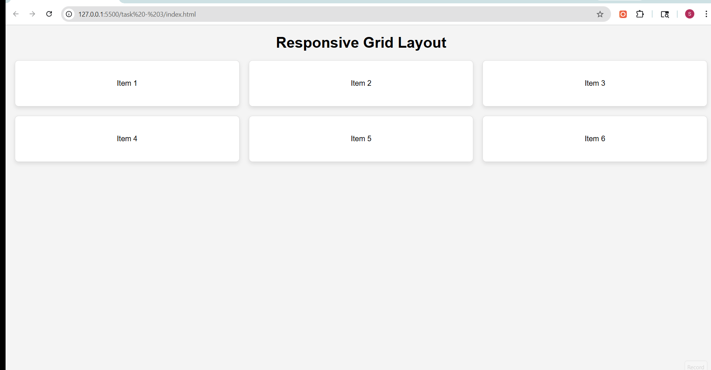

# Task 3: Responsive Grid Layout

## Objective
To create a responsive grid layout that displays multiple items using CSS Grid.

## Features Implemented
- Grid layout using CSS Grid
- Three-column layout for desktop screens
- Responsive single-column layout for smaller screens using media queries
- Consistent spacing using `gap`
- Styled grid items with borders, padding, and shadows
- Hover effects for improved interactivity

## Technologies Used
- HTML5
- CSS3 (Grid, Media Queries)

## Grid Implementation
The layout uses:
- `display: grid`
- `grid-template-columns: repeat(3, 1fr)` for equal-width columns
- `gap` property to maintain consistent spacing

## Responsiveness
A media query is used to adjust the layout:

- Desktop → 3 columns
- Mobile → 1 column

## Output
