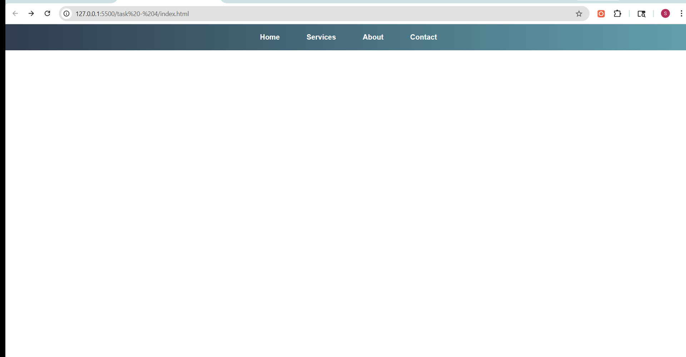

# Task 4: Pure CSS Dropdown Menu

## Objective
To design a navigation bar with a dropdown submenu using only HTML and CSS.

## Features Implemented
- Navigation bar with multiple menu items
- Dropdown submenu using nested `<ul>` elements
- Smooth reveal effect using CSS transitions
- Hover-based interaction for desktop view
- Accordion-style dropdown for mobile using the checkbox hack
- Responsive design for different screen sizes
- Styled with gradients, spacing, and hover effects for better UI

## Technologies Used
- HTML5
- CSS3 (Flexbox, Transitions, Pseudo-classes)

## Implementation Details

### Dropdown (Desktop)
- Used `:hover` pseudo-class to display submenu
- Positioned submenu using `position: absolute`
- Added transitions for smooth animation

### Mobile Fallback
- Implemented accordion-style dropdown using a hidden checkbox
- Used `:checked` pseudo-class to toggle submenu visibility
- Ensures better usability on smaller screens without JavaScript

## Output

