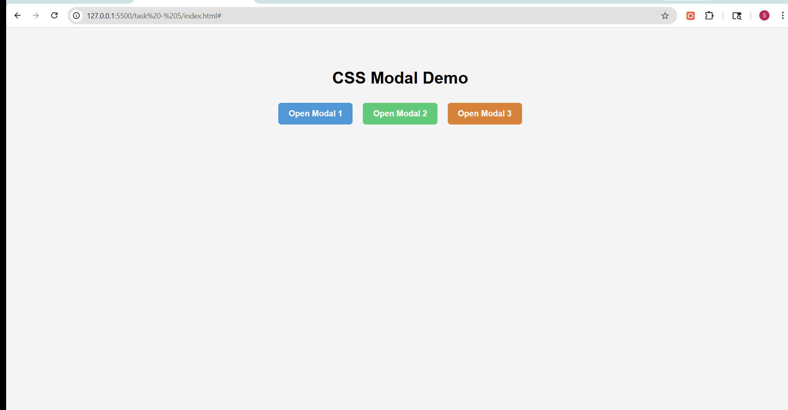

# Task 5: CSS Modal Popup

## Objective
To build a modal popup that opens and closes without using JavaScript, using only CSS techniques.

## Features Implemented
- Modal popup using the `:target` pseudo-class
- Three separate modals demonstrating reusability
- Centered modal with overlay backdrop
- Smooth open/close animations using CSS transitions and transforms
- Styled buttons with hover effects
- Clean and responsive layout

## Technologies Used
- HTML5
- CSS3 (Pseudo-classes, Transitions, Transforms)

## Implementation Details

### Modal Trigger
- Used anchor links (`href="#modal1"`, etc.) to activate modals
- Each modal has a unique `id`

### Visibility Control
- Used the `:target` pseudo-class to toggle modal visibility
- Default state: hidden using `opacity` and `visibility`
- Active state: visible when targeted

### Animation
- Applied `transform: scale()` for smooth appearance
- Used `transition` for fade and zoom effects

## Output

### Modal Interaction Demo
