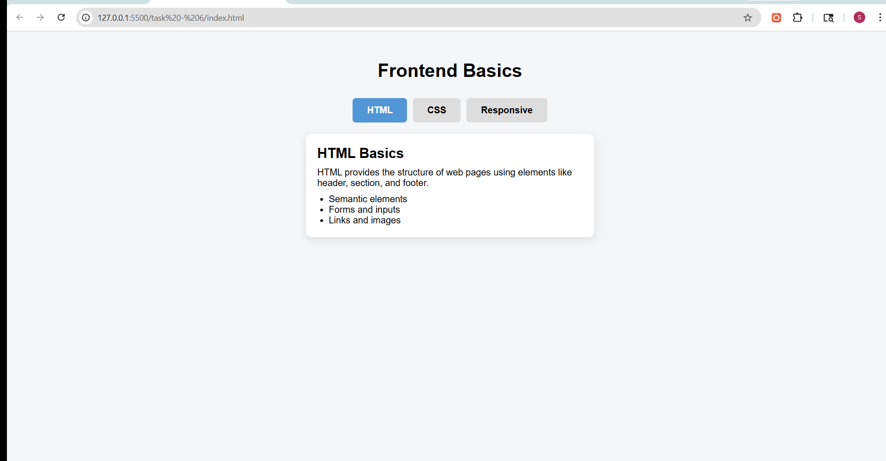

# Task 6: Tabbed Content Interface

## Objective
To create a tabbed interface using only HTML and CSS, where selecting a tab displays the corresponding content section.

## Features Implemented
- Tabbed interface using hidden radio buttons
- Clickable labels acting as tabs
- Content switching using the `:checked` pseudo-class
- Only one tab active at a time
- Smooth transitions for content appearance
- Active tab highlighting for better user experience
- Styled content sections with card-like layout

## Technologies Used
- HTML5
- CSS3 (Pseudo-classes, Transitions, Flexbox)

## Implementation Details

### Tab Mechanism
- Used hidden radio inputs (`type="radio"`) to store tab state
- Each tab is linked to a label using the `for` attribute
- Only one radio button can be selected at a time (shared `name`)

### Content Switching
- Used the `:checked` pseudo-class to display corresponding content
- CSS sibling selector (`~`) is used to target content sections

## Output

### Modal Interaction Demo

