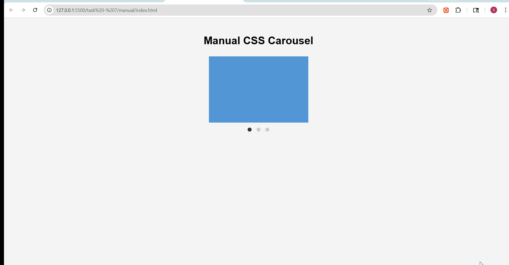
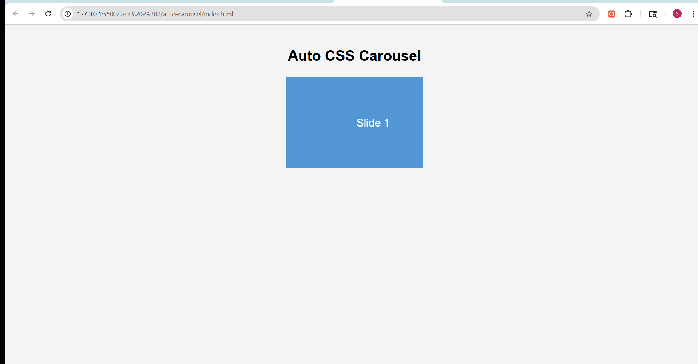

# Task 7: CSS Carousel / Slider

## Objective
To build a responsive image carousel using only HTML and CSS, with both manual and automatic sliding functionality.

## Features Implemented
- Manual carousel using radio buttons and the `:checked` pseudo-class
- Automatic carousel using CSS `@keyframes` animations
- Smooth sliding transitions using `transform`
- Navigation dots for manual control
- Active slide highlighting
- Clean and responsive layout

## Technologies Used
- HTML5
- CSS3 (Flexbox, Transforms, Transitions, Animations)

---

## Implementation Details

### Manual Carousel
- Used hidden radio inputs to track the active slide
- Labels act as navigation controls
- CSS `:checked` pseudo-class is used to shift slides using `transform`

## Output

### Slide Carousel Interaction Demo

