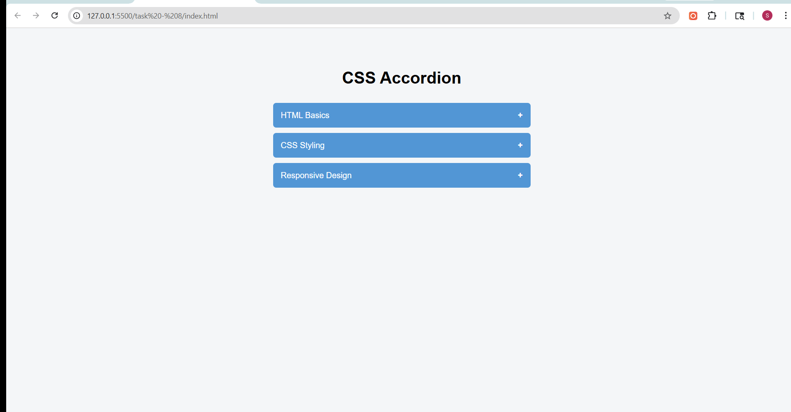

# Task 8: CSS Accordion Component

## Objective
To build an accordion interface where content sections expand and collapse using only HTML and CSS.

## Features Implemented
- Accordion layout with multiple expandable sections
- Toggle functionality using hidden checkboxes
- Smooth expand/collapse animation using CSS transitions
- Multiple sections can be open simultaneously
- Visual indicator (+ / -) for open and closed states
- Clean and responsive design

## Technologies Used
- HTML5
- CSS3 (Pseudo-classes, Transitions)

## Implementation Details

### Accordion Mechanism
- Used hidden checkbox inputs to control the open/closed state
- Labels are used as clickable headers
- Each label is linked to its corresponding checkbox using the `for` attribute

### Content Toggle
- Used the `:checked` pseudo-class to control visibility
- CSS adjacent sibling selector (`+`) is used to target content sections

## Output

### Accordion Interaction Demo
