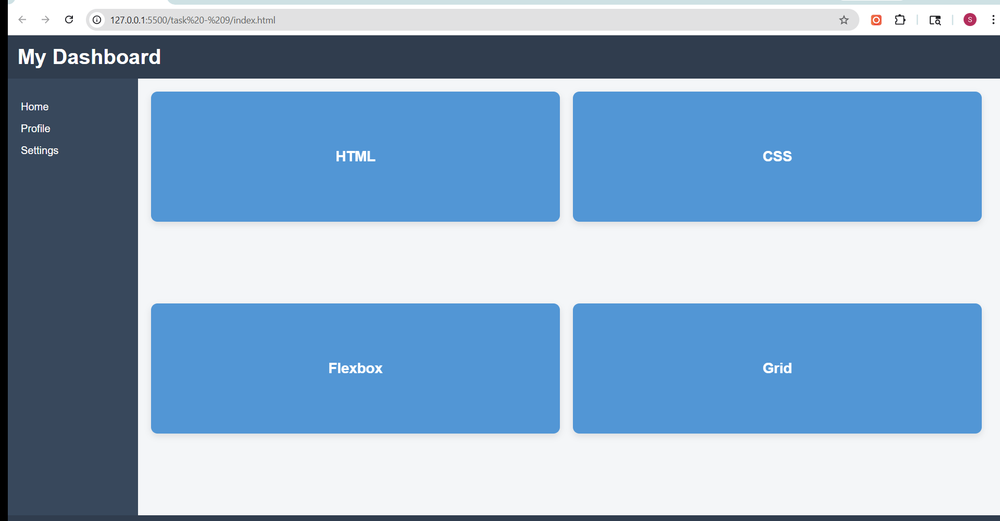

# Task 9: Complex Responsive Layout (Grid + Flexbox)

## Objective
To design a complex responsive webpage layout using a combination of CSS Grid and Flexbox, along with interactive UI elements.

## Features Implemented
- Full-page layout using CSS Grid
- Sticky header for persistent navigation
- Sidebar navigation section
- Main content area with responsive card layout using Flexbox
- Interactive flip cards using CSS 3D transforms
- Smooth hover animations and transitions
- Fully responsive design using media queries

## Technologies Used
- HTML5
- CSS3 (Grid, Flexbox, Transforms, Transitions, Media Queries)

---

## Implementation Details

### Layout Structure (CSS Grid)
- Used CSS Grid to define the overall page structure
- Implemented grid areas for:
  - Header
  - Sidebar
  - Main content
  - Footer

### Example:
- ```css
- .container {
    display: grid;
    grid-template-areas:
        "header header"
        "sidebar main"
        "footer footer";
}

### Card Layout (Flexbox)

- Used Flexbox inside the main section to arrange cards

- Enabled wrapping and spacing using flex-wrap and gap

### Flip Card Animation

- Implemented interactive flip cards using:

     - transform: rotateY()

     - perspective for 3D effect

     - transform-style: preserve-3d

### Example:

- .card:hover .card-inner {
    transform: rotateY(180deg);
}

## Output

### Grid-Flexbox Interaction Demo

