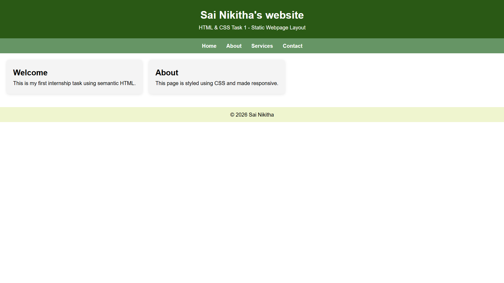
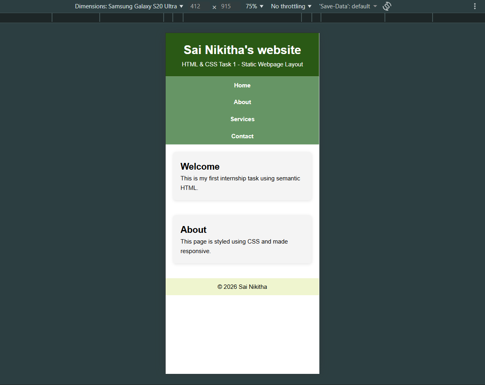
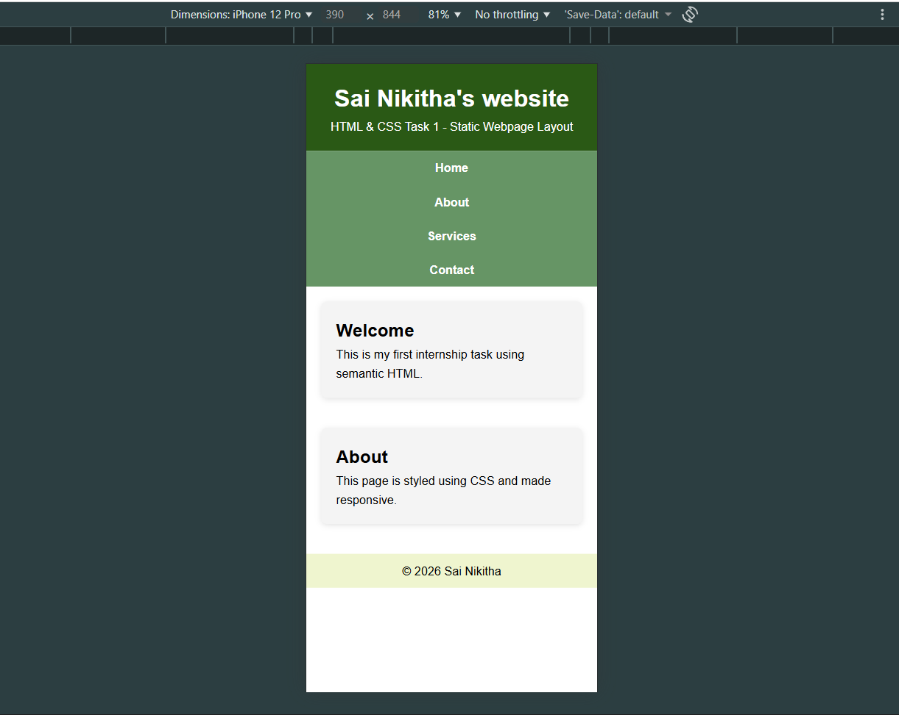

# Task 1: Static Webpage Layout

## Objective
Create a responsive static webpage using semantic HTML and basic CSS.

## Features Implemented
- Semantic HTML structure using header, nav, main, section, and footer
- Navigation bar using Flexbox
- Card-based content layout
- Responsive design using media queries
- Hover effects for better interactivity

## Technologies Used
- HTML5
- CSS3 (Flexbox, Media Queries)

## Output

### Desktop View

### Mobile View

